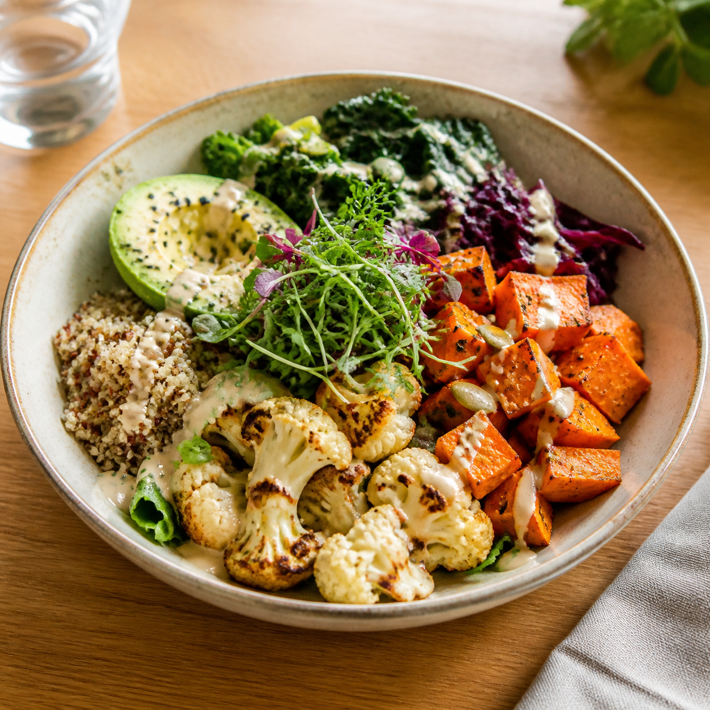
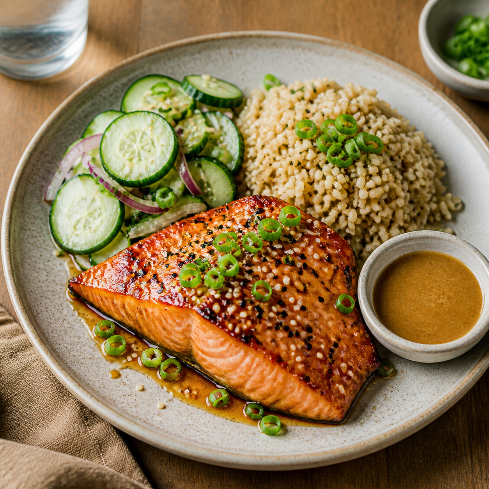

<p align="center">
  <a href="#english">English</a> | <a href="#simplified-chinese">简体中文</a>
</p>

<p align="center">
  
</p>

<h1 id="english" align="center">Odyssey Restaurant Ops</h1>

<p align="center">
  A fullstack restaurant operations dashboard for menu management, order flow, customer insight, and service settings.
</p>

<p align="center">
  
  
</p>

## Product

Odyssey Restaurant Ops is a compact back-office product for a modern restaurant team. It gives operators one place to watch live service, create orders, manage menu availability, review customer history, and tune ordering settings.

The product is designed as a real operations tool rather than a static mock: pages have interactive state, reusable UI primitives, backend-owned order rules, and a contract-first TypeScript architecture.

## What You Can Do

- Track revenue, order volume, pending work, prep time, popular items, and recent activity on Home.
- Create orders, filter the queue, inspect order details, and move orders through valid status actions.
- Review CRM data with customer contact details, spend, order counts, and recent order signals.
- Manage menu categories and menu items, including price and availability changes.
- Update ordering settings such as prep time, auto-accept, service availability, tax rate, and opening hours.
- Browse the UI Library route to inspect tokens, typography, spacing, surfaces, components, and states.

## Stack

- pnpm workspace + Turborepo
- Expo + React Native + Web dashboard in `apps/dashboard`
- Hono API on Cloudflare Workers in `services/backend`
- PostgreSQL + Drizzle ORM + drizzle-zod
- OpenAPI contract generation
- Orval-style API client/hooks package in `packages/api-client`
- React Query
- Shared design tokens and utilities in `packages/shared`

## Architecture

The intended contract pipeline is:

```text
Drizzle schema -> drizzle-zod -> Hono/OpenAPI -> Orval -> frontend hooks/types
```

Data ownership starts in the Drizzle schema. Backend domain services own persistence validation, menu availability checks, server-side totals, and explicit order status transitions. The dashboard composes product flows from generated client hooks, shared formatting helpers, and reusable UI primitives.

## Repository Map

```text
apps/dashboard        Expo web dashboard and UI composition
services/backend      Hono Worker, Drizzle schema, order domain logic
packages/shared       design tokens, status labels, formatting helpers
packages/api-client   typed client/hooks exports for the dashboard
docs/assets           README and product preview assets
```

## Local Setup

```bash
pnpm install
cp .env.example .env
cp services/backend/.dev.vars.example services/backend/.dev.vars
pnpm dev:dashboard
pnpm dev:backend
```

Set `DATABASE_URL` in both `.env` and `services/backend/.dev.vars` before running the backend. The Worker runtime uses the same PostgreSQL URL through the Neon serverless driver, so a Neon/PostgreSQL connection string with SSL is the expected happy path for review.

## Database Setup

Apply the Drizzle schema and load deterministic demo data:

```bash
pnpm db:setup
```

Equivalent individual commands:

```bash
pnpm db:push
pnpm db:seed
```

The seed is reset-style by design: it clears restaurant operations tables, then inserts menu categories, menu items with generated dish image URLs, customers, settings, and 30 orders across different statuses and service hours. This makes Home, Orders, CRM, Menu, and Settings interesting immediately after setup.

All 11 generated menu photos are available in `docs/assets/menu-images` and served by the dashboard from `apps/dashboard/public/menu-images`.

Useful root scripts:

```bash
pnpm build:dashboard
pnpm db:setup
pnpm deploy:backend
pnpm gen:contract
pnpm lint
pnpm typecheck
pnpm test
```

Backend package scripts:

```bash
pnpm --filter @repo/backend db:generate
pnpm --filter @repo/backend db:push
pnpm --filter @repo/backend seed
```

## Deployment

Recommended reviewer-friendly deployment:

- Dashboard: Vercel
- API: Cloudflare Workers
- Database: Neon Postgres

Live review URLs:

- Dashboard: https://dist-alane-3620s-projects.vercel.app
- API: https://odyssey-restaurant-backend.cuidong111.workers.dev
- API health check: https://odyssey-restaurant-backend.cuidong111.workers.dev/health

Backend setup:

```bash
pnpm db:push
pnpm db:seed
pnpm --filter @repo/backend wrangler secret put DATABASE_URL
pnpm deploy:backend
```

Use the Neon pooled PostgreSQL connection string with SSL for `DATABASE_URL`. Do not commit `.env` or `.dev.vars`.

Frontend setup for Vercel:

```bash
pnpm build:dashboard
```

Vercel settings:

- Build command: `pnpm build:dashboard`
- Build output directory: `apps/dashboard/dist`
- Environment variable: `EXPO_PUBLIC_API_URL=https://odyssey-restaurant-backend.cuidong111.workers.dev`

The dashboard must be built with `EXPO_PUBLIC_API_URL` set. Otherwise the generated web bundle falls back to `http://localhost:8787`, which only works for local development.

GitHub Actions CI/CD:

- `.github/workflows/ci.yml` runs contract generation, generated-artifact drift checks, typecheck, tests, lint, and the dashboard web build on pull requests and `main`.
- `.github/workflows/vercel.yml` validates first, then deploys Vercel preview builds for pull requests and production builds for pushes to `main` or manual dispatches.
- Required GitHub repository secrets:
  - `VERCEL_TOKEN`
  - `VERCEL_ORG_ID`
  - `VERCEL_PROJECT_ID`
- Vercel project environment variables still need `EXPO_PUBLIC_API_URL` configured for Preview and Production.

## Current Build Notes

Implemented pieces include the Expo web dashboard shell, shared design tokens, reusable UI primitives, Drizzle schema and migrations, reset-style demo seed data, backend OpenAPI generation, generated contract types, Orval-generated React Query hooks, and backend order-domain tests for order creation and status rules.

Tradeoff: the Worker-oriented database path is optimized for a Neon/PostgreSQL URL rather than a bundled Docker database. Frontend test coverage is intentionally focused on orchestration helpers and state rules rather than full browser automation.

<p align="center">
  <a href="#english">English</a> | <a href="#simplified-chinese">简体中文</a>
</p>

<p align="center">
  
</p>

<h1 id="simplified-chinese" align="center">Odyssey Restaurant Ops</h1>

<p align="center">
  一个用于菜单管理、订单流转、客户洞察和营业设置的全栈餐厅运营后台。
</p>

<p align="center">
  
  
</p>

## 产品介绍

Odyssey Restaurant Ops 是一个面向现代餐厅团队的小型运营工作台。店员和运营者可以在一个界面里查看实时营业状态、创建订单、管理菜单可售状态、查看客户历史，并调整点单相关设置。

这个项目不是静态展示页，而是按真实后台产品来构建：页面有交互状态，可复用 UI primitives，订单规则由后端领域逻辑负责，并采用契约优先的 TypeScript 架构。

## 核心功能

- 在 Home 查看收入、订单量、待处理订单、平均备餐时间、热门菜品和最近动态。
- 在 Orders 创建订单、筛选队列、查看订单详情，并通过合法动作推进订单状态。
- 在 CRM 查看客户联系方式、消费金额、订单数量和最近下单信号。
- 在 Menu 管理菜单分类、菜品价格和可售状态。
- 在 Settings 调整备餐时间、自动接单、营业状态、税率和营业时间。
- 在 UI Library 查看 tokens、字体、间距、surface、组件和不同状态。

## 技术栈

- pnpm workspace + Turborepo
- `apps/dashboard`：Expo + React Native + Web dashboard
- `services/backend`：运行在 Cloudflare Workers 上的 Hono API
- PostgreSQL + Drizzle ORM + drizzle-zod
- OpenAPI 契约生成
- `packages/api-client`：面向 dashboard 的 API client/hooks 包
- React Query
- `packages/shared`：共享 design tokens 和工具函数

## 架构

目标契约链路：

```text
Drizzle schema -> drizzle-zod -> Hono/OpenAPI -> Orval -> frontend hooks/types
```

数据真源从 Drizzle schema 开始。后端领域服务负责持久化校验、菜单可售性检查、服务端价格计算，以及显式的订单状态流转。前端 dashboard 通过 client hooks、共享格式化工具和可复用 UI primitives 组合出产品流程。

## 仓库结构

```text
apps/dashboard        Expo Web 后台和页面组合
services/backend      Hono Worker、Drizzle schema、订单领域逻辑
packages/shared       design tokens、状态文案、格式化工具
packages/api-client   dashboard 使用的 typed client/hooks exports
docs/assets           README 和产品预览资源
```

## 本地运行

```bash
pnpm install
cp .env.example .env
cp services/backend/.dev.vars.example services/backend/.dev.vars
pnpm dev:dashboard
pnpm dev:backend
```

启动后端前，请在 `.env` 和 `services/backend/.dev.vars` 中设置 `DATABASE_URL`。Worker 运行时通过 Neon serverless driver 连接同一个 PostgreSQL URL，因此带 SSL 的 Neon/PostgreSQL 连接串是最顺畅的 review 路径。

## 数据库初始化

应用 Drizzle schema 并加载确定性的 demo 数据：

```bash
pnpm db:setup
```

也可以分开执行：

```bash
pnpm db:push
pnpm db:seed
```

seed 是 reset-style：会清空餐厅运营相关表，然后写入菜单分类、带生成菜品图片 URL 的菜品、客户、设置，以及覆盖不同状态和营业时段的 30 笔订单。初始化后 Home、Orders、CRM、Menu、Settings 都会立刻有数据可看。

11 张生成菜品图都在 `docs/assets/menu-images`，dashboard 运行时从 `apps/dashboard/public/menu-images` 提供这些图片。

常用根命令：

```bash
pnpm build:dashboard
pnpm db:setup
pnpm deploy:backend
pnpm gen:contract
pnpm lint
pnpm typecheck
pnpm test
```

后端相关命令：

```bash
pnpm --filter @repo/backend db:generate
pnpm --filter @repo/backend db:push
pnpm --filter @repo/backend seed
```

## 部署

推荐的 review 部署组合：

- Dashboard：Vercel
- API：Cloudflare Workers
- Database：Neon Postgres

线上 review 地址：

- Dashboard：https://dist-alane-3620s-projects.vercel.app
- API：https://odyssey-restaurant-backend.cuidong111.workers.dev
- API health check：https://odyssey-restaurant-backend.cuidong111.workers.dev/health

后端部署：

```bash
pnpm db:push
pnpm db:seed
pnpm --filter @repo/backend wrangler secret put DATABASE_URL
pnpm deploy:backend
```

`DATABASE_URL` 使用 Neon 带 SSL 的 pooled PostgreSQL 连接串。不要提交 `.env` 或 `.dev.vars`。

Vercel 前端设置：

```bash
pnpm build:dashboard
```

Vercel 配置：

- Build command：`pnpm build:dashboard`
- Build output directory：`apps/dashboard/dist`
- Environment variable：`EXPO_PUBLIC_API_URL=https://odyssey-restaurant-backend.cuidong111.workers.dev`

前端构建时必须设置 `EXPO_PUBLIC_API_URL`。否则 web bundle 会回退到 `http://localhost:8787`，这个地址只适合本地开发。

GitHub Actions CI/CD：

- `.github/workflows/ci.yml` 会在 PR 和 `main` 上运行合约生成、生成物漂移检查、类型检查、测试、lint、dashboard web 构建。
- `.github/workflows/vercel.yml` 会先验证，再在 PR 上部署 Vercel Preview，在 push 到 `main` 或手动触发后部署 Production。
- GitHub 仓库需要配置 secrets：
  - `VERCEL_TOKEN`
  - `VERCEL_ORG_ID`
  - `VERCEL_PROJECT_ID`
- Vercel 项目的 Preview 和 Production 环境仍需要配置 `EXPO_PUBLIC_API_URL`。

## 当前状态

已经完成的部分包括 Expo Web dashboard shell、共享 design tokens、可复用 UI primitives、Drizzle schema 和迁移、reset-style demo seed、后端 OpenAPI 生成、生成式契约类型、Orval 生成的 React Query hooks，以及覆盖订单创建和状态规则的后端领域测试。

取舍：数据库路径优先适配 Worker 友好的 Neon/PostgreSQL URL，而不是内置 Docker 数据库。前端测试目前聚焦 orchestration helpers 和状态规则，没有扩展到完整浏览器自动化。
